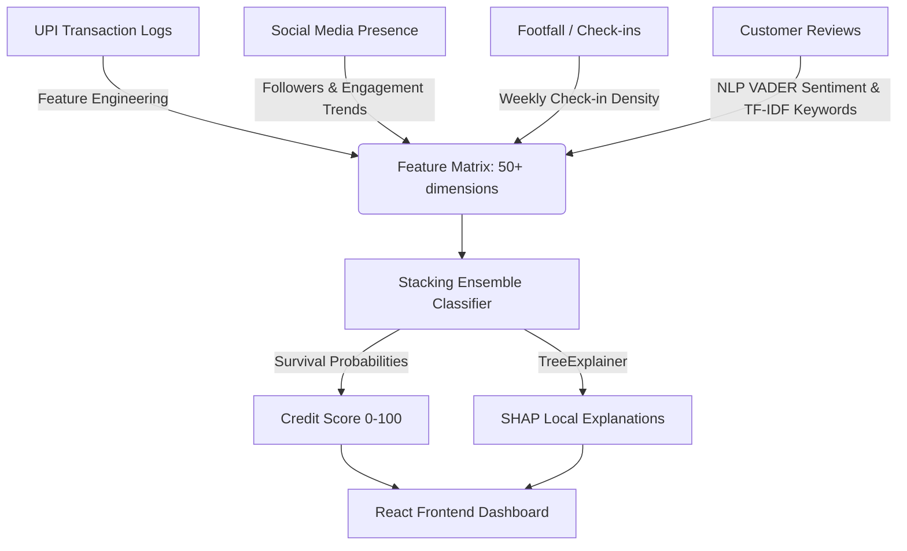

# 🪙 AlternaTrust: Explainable Alternative Credit Underwriting Engine

[](https://fastapi.tiangolo.com/)
[](https://reactjs.org/)
[](https://tailwindcss.com/)
[](https://scikit-learn.org/)
[](https://xgboost.readthedocs.io/)

**AlternaTrust** is a state-of-the-art, explainable machine learning underwriting engine designed to score small business creditworthiness using alternative data feeds. It specifically targets micro-merchants in India (e.g., gyms, cafes, salons, and retail shops) who operate primarily in cash-heavy environments and lack traditional corporate credit ratings (such as CIBIL scores or formal audited balance sheets).

---

## 📸 Dashboard Preview

*A sneak peek at the **AlternaTrust** credit analyst interface, showing merchant risk tiers, time-series telemetry streams, and local model explanations:*

```
┌────────────────────────────────────────────────────────────────────────┐
│  AlternaTrust Credit Underwriting Portal                      [ Dark ] │
├────────────────────────────────────────────────────────────────────────┤
│  [Dashboard]  [Underwriting Analysis]  [Batch Upload]  [Model Metrics] │
├────────────────────────────────────────────────────────────────────────┤
│  ┌─────────────────────────┐  ┌─────────────────────────────────────┐  │
│  │ Avg Credit Score        │  │ Money Insights (Inflow vs Outflow)  │  │
│  │ 68.4 / 100              │  │  ┌───┐          ┌───┐               │  │
│  │ [+3.6%]                 │  │  │   │  ┌───┐   │   │  ┌───┐        │  │
│  └─────────────────────────┘  │  │   │  │   │   │   │  │   │        │  │
│  ┌─────────────────────────┐  │  └───┴──┴───┴───┴───┴──┴───┴────────┘  │
│  │ Scored Merchants        │  │   Gym    Salon   Cafe   Retail      │  │
│  │ 🔍 Search...            │  └─────────────────────────────────────┘  │
│  │ ─────────────────────── │  ┌─────────────────────────────────────┐  │
│  │ 1. Chai Point   [82.0]  │  │ Real-time Explainable SHAP Factors  │  │
│  │ 2. Gold's Gym   [44.2]  │  │  ■ Average Review Sentiment  (+0.14)│  │
│  │ 3. Gloss Salon  [61.5]  │  │  ■ Cash Flow Volatility      (-0.09)│  │
│  └─────────────────────────┘  └─────────────────────────────────────┘  │
└────────────────────────────────────────────────────────────────────────┘
```

---

## ⚙️ Architecture & Data Pipelines

AlternaTrust replaces static financial balance sheets with **real-time behavioral proxy telemetry** structured into four streams:



### Alternative Telemetry Streams:
1. **UPI Transactions**: Evaluates total revenue throughput, weekly cash flow volatility (Coefficient of Variation), average ticket size per sale, volume growth slope, and recent sales momentum.
2. **Social Media activity**: Analyzes follower volume, posting frequency, audience engagement percentage, and follower growth trends.
3. **Footfall (Check-ins)**: Measures total visit counts, check-in growth rates, and density during peak operating hours.
4. **Reviews & Sentiment**: Runs VADER Sentiment Analysis on customer feedback, extracts top TF-IDF keywords, and evaluates rating trends.

---

## 🧠 Stacking Ensemble Model (Champion)

AlternaTrust uses a **Stacking Classifier** to combine diverse algorithms into a highly calibrated underwriting model.

### Ensemble Structure:
* **Base Estimators**: XGBoost, LightGBM, Random Forest, and L2-regularized Logistic Regression.
* **Meta-Classifier**: Logistic Regression (`C=1.0`).
* **SHAP Explainer**: Random Forest Classifier `TreeExplainer` for fast local and global explanation calculations.

### Test Set Performance ($N = 160$ stratified samples):

| Model | ROC-AUC | PR-AUC | F1-Score | Brier Calibration |
| :--- | :---: | :---: | :---: | :---: |
| **Stacking Ensemble (Champion)** | **0.7964** | **0.8111** | **0.7841** | **0.1874** |
| Random Forest | 0.7950 | 0.8083 | 0.7865 | 0.1905 |
| XGBoost Classifier | 0.7906 | 0.8019 | 0.7594 | 0.1942 |
| LightGBM Classifier | 0.7890 | 0.7983 | 0.7709 | 0.1946 |
| Logistic Regression | 0.7876 | 0.7986 | 0.7831 | 0.1928 |

For a complete breakdown of model parameters, warnings, and limitations, check out the [Model Card](file:///d:/AI-Powered Alternative Credit/models/model_card.md).

---

## 📁 Repository Directory Structure

```
.
├── backend/
│   └── main.py              # FastAPI Web API with pre-loaded models & cache
├── data/
│   ├── generate_data.py     # Relational synthetic data generator (Faker)
│   └── *.csv                # Raw telemetry CSV streams
├── frontend/
│   ├── src/                 # React UI Components, Charts, and Styles
│   ├── package.json         # Node.js frontend configuration
│   └── vite.config.js       # Vite build configurations
├── models/
│   ├── features.py          # Relational Feature Engineering definition
│   ├── train.py             # Hyperparameter tuning (Optuna) & model training
│   ├── model_card.md        # Technical Model Documentation & Limitations
│   └── *.joblib             # Serialized ML pipelines & SHAP explainers
├── notebooks/
│   └── EDA_and_Modeling.ipynb # Data exploration & experiment environment
├── tests/
│   └── test_backend.py      # FastAPI routing & endpoint unit tests
├── requirements.txt         # Python package dependencies
└── README.md                # Project documentation (this file)
```

---

## 🚀 Getting Started

### Prerequisites
* Python 3.9+
* Node.js v16+
* npm or yarn

### 1. Python Backend Setup
Initialize your virtual environment, install requirements, and run the FastAPI server:

```bash
# Clone the repository
cd AI-Powered-Alternative-Credit

# Create a virtual environment
python -m venv .venv
source .venv/bin/activate  # On Windows: .venv\Scripts\activate

# Install python dependencies
pip install -r requirements.txt

# Run the backend FastAPI server
cd backend
python main.py
```
The FastAPI documentation will be available at `http://127.0.0.1:8000/docs`.

### 2. Frontend React Dashboard Setup
Install Node dependencies and start the Vite development server in another terminal:

```bash
cd frontend
npm install
npm run dev
```
Open `http://localhost:5173/` in your browser.
> **Login Credentials**: Use `analyst@alternatrust.com` with password `admin123` to log in.

### 3. Model Training & Data Regeneration (Optional)
If you want to regenerate synthetic business data or retrain the ML model stack:

```bash
# Regenerate alternative credit logs (creates fresh CSV data feeds)
python data/generate_data.py

# Run the Optuna tuning and model training script
python models/train.py
```

### 4. Running Backend Tests
To run unit and integration tests for the FastAPI backend:

```bash
# Execute pytest from the root folder
pytest
```

---

## 🛡️ Operational Warnings & Mitigation
* **Proxy Target Variable**: Trained on a 12-month business survival label rather than raw loan defaults. Models must be recalibrated with actual delinquency records once credit lines are extended.
* **Fraud Safeguards**: Social media streams and online review ratings can be manipulated. Fraud-detection filters should be deployed to catch inorganic spikes (e.g., bought followers).
* **Imputed Telemetry**: Missing sync events trigger `KNNImputer`, which can degrade explanation confidence. Ensure active API hooks are maintained.
